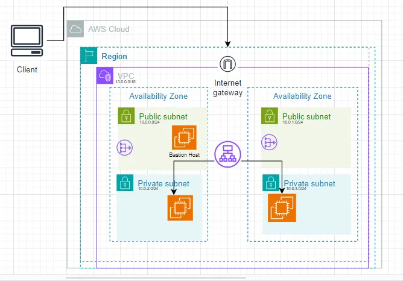

# high-availability-web-app-with-cloudformation
This project focus on create a high availability infrastructure that can handle loads using AWS Cloudformation. This also a part of my Udacity Cloud Devops Nanodegree project.

The README will provide a comprehensive overview of the deployment process and guidance on how to release new builds and deploy changes to environment.

<p align="center">
  
</p>
<p align="center">Architecture Diagram</p>

---
## Technologies and Tools Used
- **Linux Environment**: This instruction is based on Linux environment command, if you use window or others please consider the changes.
- **AWS CloudFormation**: Infrastructure as code (IaC) tool used to automate the provisioning and management of the infrastructure, including VPC, Route tables, Security groups, IAM roles, and more.

---
## Deployment Process
### 1. **Create Key Pairs**
- Search for EC2 Key Pair in AWS Console
- Create two key pair:
    - private-server-keypair.pem
    - bastion-host-keypair.pem

### 2. **Infrastructure Setup with CloudFormation**
You can use automation script to create and delete resource using:
```bash
chmod +x create.sh delete.sh

```
- To create stacks:
```bash
./create_stacks.sh
```
- To delete stacks:
```bash
./delete_stacks.sh
```

Or Open CloudFormation page in AWS Console and deploy each stack on at a time using commands:
Stack Network 
```bash
aws cloudformation create-stack --stack-name NetworkStack --template-body file://network.yml --parameters file://network-parameters.json --region us-east-1
```

Stack Server
```bash
aws cloudformation create-stack --stack-name ServerStack --template-body file://server.yml --parameters file://server-parameters.json  --capabilities "CAPABILITY_IAM" "CAPABILITY_NAMED_IAM" --region us-east-1
```

Stack Bastion
```bash
aws cloudformation create-stack --stack-name BastionHostStack --template-body file://bastion-host.yml --parameters file://bastion-host-parameters.json  --capabilities "CAPABILITY_IAM" "CAPABILITY_NAMED_IAM" --region us-east-1
```

Check out for ALB in CloudFormation > Stack details > Outputs

### 3. **SSH to bastion and ec2 servers**
Check out ip address of bastion host and ec2 server:
- IP-bastion-host (Public IP): 3.84.88.47
- IP-private-server (Private IP): 10.0.2.201

Copy Key Pair to Bastion Host:
```bash
scp -i bastion-host-keypair.pem private-server-keypair.pem ubuntu@<bastion-host-ip>:/home/ubuntu/private-server-keypair.pem
```

SSH login to the Bastion Host
```bash
ssh ubuntu@<bastion-host-ip> -i bastion-host-keypair.pem
```

Copy the private IP address of any private server
```bash
ls
## make sure you see the private-server-keypair.pem file
chmod 400 private-server-keypair.pem
ssh -i private-server-keypair.pem ubuntu@<private-server-ip>
```

### 4. **Destroy resources**
Stack Bastion
```bash
aws cloudformation delete-stack --stack-name myBastionHost --region us-east-1
```
Stack Server
```bash
aws cloudformation delete-stack --stack-name myServer --region us-east-1
```
Stack Network
```bash
aws cloudformation delete-stack --stack-name myNetwork --region us-east-1
```

## Troubleshooting
1. In case can't copy the key pair to bastion host:
Connect to bastion host though:
```bash
sudo chmod 400 bastion-host-keypair.pem
sudo ssh -i bastion-host-keypair.pem ubuntu@<bastion-host-ip>
```
Create the private-server-keypair.pem in bastion host
```bash
nano private-server-keypair.pem #Copy the content of private-server-keypair.pem 
```
Saving the file using ctrl+X, then access to the private server as above.